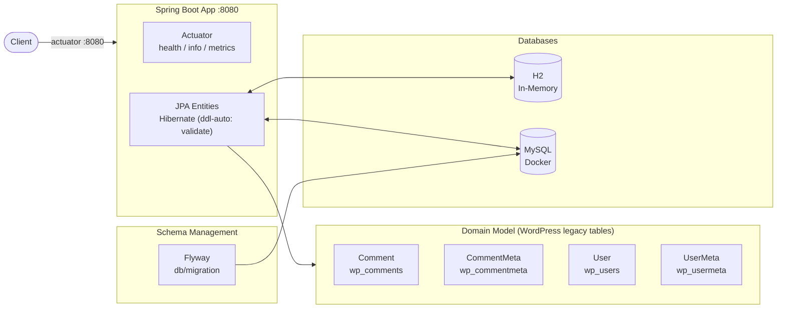
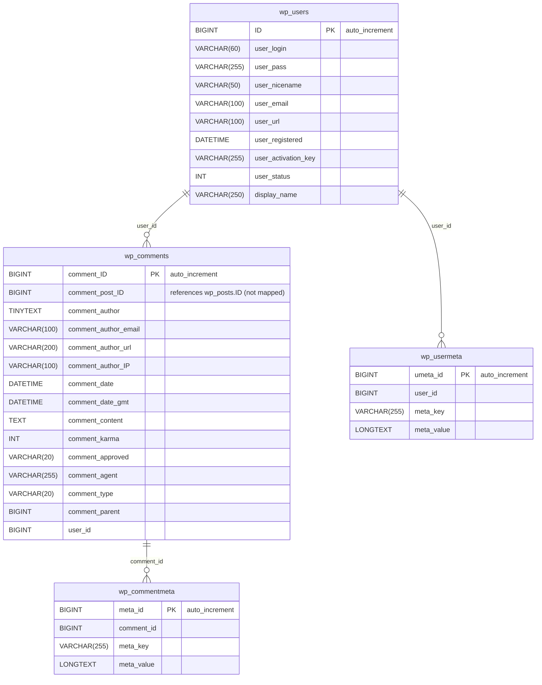

# Spring Data JPA Wordpress

Spring Boot 4 / Spring Data JPA demo project on Java 25, demonstrating JPA legacy database
mapping of the WordPress schema: the entities `Comment`, `CommentMeta`, `User` and `UserMeta`
map to the existing WordPress tables without modifying the original schema, against H2
(MySQL-compat mode) and MySQL, with schema management via Flyway.

## Architecture Overview



## Database Schema

Only a subset of the WordPress schema is mapped as JPA entities (the remaining legacy tables such as
`wp_posts` or `wp_options` stay untouched):



## Flyway

The `mysql` profile enables Flyway out of the box (`application-mysql.yaml` also sets
`spring.docker.compose.file: compose-mysql.yaml`), so no property overrides are needed. This profile
starts MySQL on port 3306 using the Docker Compose file `compose-mysql.yaml`. The migrations live in
`src/main/resources/db/migration`. In the `h2` profile Flyway is disabled and the schema is created
via `h2-schema.sql` / `h2-data.sql`.

## Docker

The Docker Compose file mounts the init script `src/scripts/init-mysql.sql`, which creates the
database and the users `wpadmin`/`wpuser`.

### Deployment with Helm

Be aware that we are using a different namespace here (not default).

Go to the directory where the tgz file has been created after 'mvn install'

```powershell
cd target/helm/repo
```

unpack

```powershell
$file = Get-ChildItem -Filter sdjpa-wordpress-chart-*.tgz | Select-Object -First 1
tar -xvf $file.Name
```

install

```powershell
$APPLICATION_NAME = Get-ChildItem -Directory | Where-Object { $_.LastWriteTime -ge $file.LastWriteTime } | Select-Object -ExpandProperty Name
helm upgrade --install $APPLICATION_NAME ./$APPLICATION_NAME --namespace sdjpa-wordpress --create-namespace --wait --timeout 5m --debug
```

show logs

```powershell
kubectl get pods -n sdjpa-wordpress
```

replace $POD with pods from the command above

```powershell
kubectl logs $POD -n sdjpa-wordpress --all-containers
```

Show Endpoints

```powershell
kubectl get endpoints -n sdjpa-wordpress
```

test

```powershell
helm test $APPLICATION_NAME --namespace sdjpa-wordpress --logs
```

status

```powershell
helm status $APPLICATION_NAME --namespace sdjpa-wordpress
```

uninstall

```powershell
helm uninstall $APPLICATION_NAME  --namespace sdjpa-wordpress
```

delete all

```powershell
kubectl delete all --all -n sdjpa-wordpress
```

create busybox sidecar

```powershell
kubectl run busybox-test --rm -it --image=busybox:1.36 --namespace=sdjpa-wordpress --command -- sh
```

You can use the actuator rest call to verify via port 30080

## Running the Application

1. Choose between h2 or mysql for database schema management. (you can use one of the preconfigured intellij runners)
2. Start the application with the appropriate profile and properties.
3. The application will use Docker Compose to start MySQL and apply the database schema changes.

## Sandbox (local dev environment)

The sandbox is provisioned by the opencode-sandbox-kit and runs as a Docker container. It mounts this
repo, starts the agent, and connects the IntelliJ MCP server. The app runs on port `8080`; `compose-mysql.yaml`
provides MySQL.

Allow the kit source (GitHub without cloning):

```powershell
sbx settings set kit.allowedSources --% "[\"docker.io/\",\"github.com/dboeckli/\"]
```

Start a new sandbox:

```powershell
sbx run opencode `
    --kit "git+https://github.com/dboeckli/opencode-sandbox-kit.git#dir=opencode-agent" `
    --template docker.io/domboeckli/sbx-opencode-tooling:latest `
    --skills=off `
    --static-mcp idea `
    . `
    "C:\development\maven-repo:ro"
```

Start the sandbox with Kubernetes support:

```powershell
sbx run opencode `
    --kit "git+https://github.com/dboeckli/opencode-sandbox-kit.git#dir=opencode-agent" `
    --template docker.io/domboeckli/sbx-opencode-tooling:latest `
    --skills=off `
    --static-mcp idea `
    . `
    "C:\development\maven-repo:ro" `
    "$env:USERPROFILE\.kube:ro"
```

Claude Code (Home) and Mammouth Code variants:

```powershell
sbx run claude `
    --kit "git+https://github.com/dboeckli/opencode-sandbox-kit.git#dir=opencode-agent" `
    --template docker.io/domboeckli/sbx-claude-tooling:latest `
    --skills=off `
    --static-mcp idea `
    . `
    "C:\development\maven-repo:ro"
```

```powershell
sbx run "git+https://github.com/dboeckli/opencode-sandbox-kit.git#dir=mammouth-agent" `
    --kit-arg imageTag=latest `
    --skills=off `
    --static-mcp idea `
    . `
    "C:\development\maven-repo:ro"
```

### Start the app

Start MySQL (H2 needs no Docker):

```shell
docker compose -f compose-mysql.yaml up
```

Then run one of the IntelliJ run configurations (`.run/Spring6Application h2.run.xml` or the MySQL
one) or start via `./mvnw spring-boot:run -Dspring-boot.run.profiles=h2`.

### Sandbox build quirk

The sandbox mounts the repo via filesystem passthrough, which blocks symlinks — Spotless's `npm install`
(prettier) would fail with `EPERM` unless npm skips bin links. The kit sets `npm_config_bin_links=false`
globally, so no manual export is needed.
